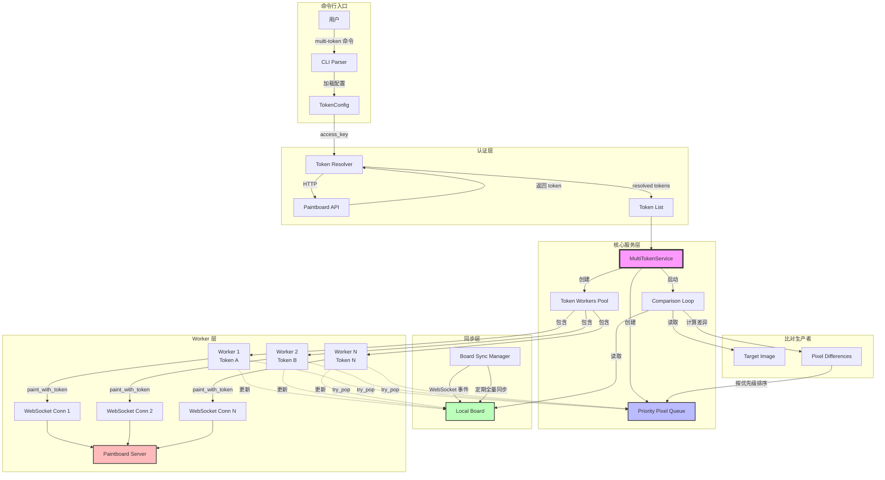
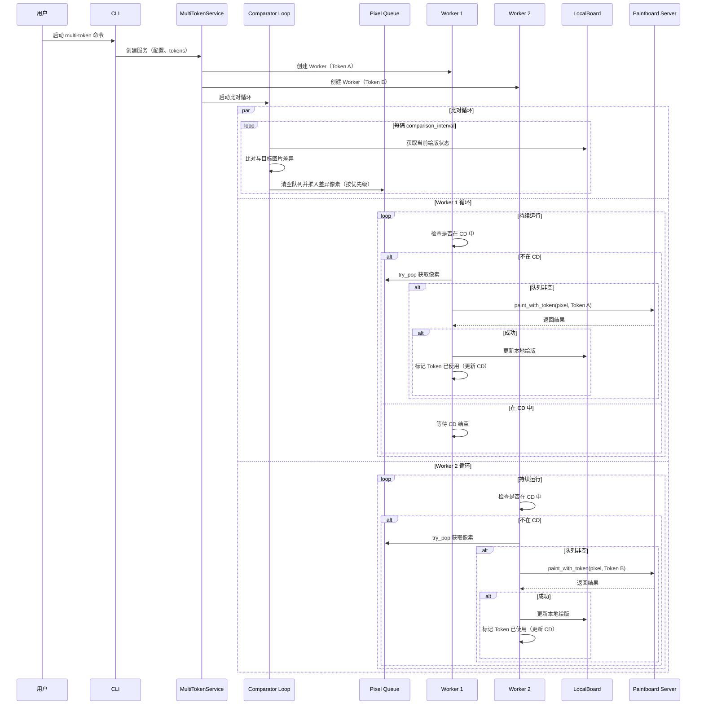
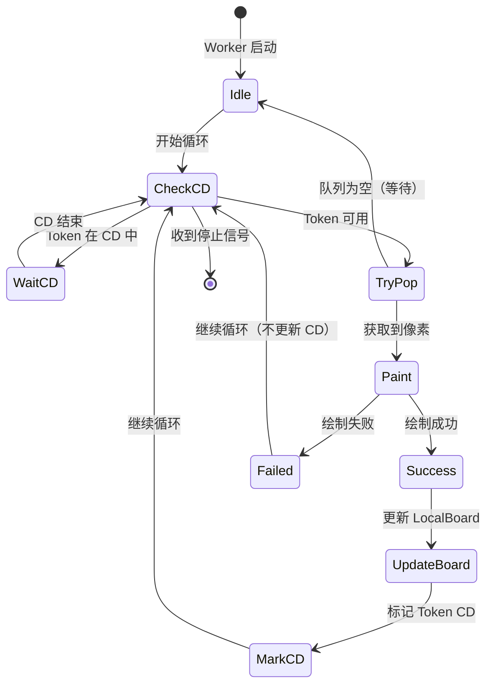
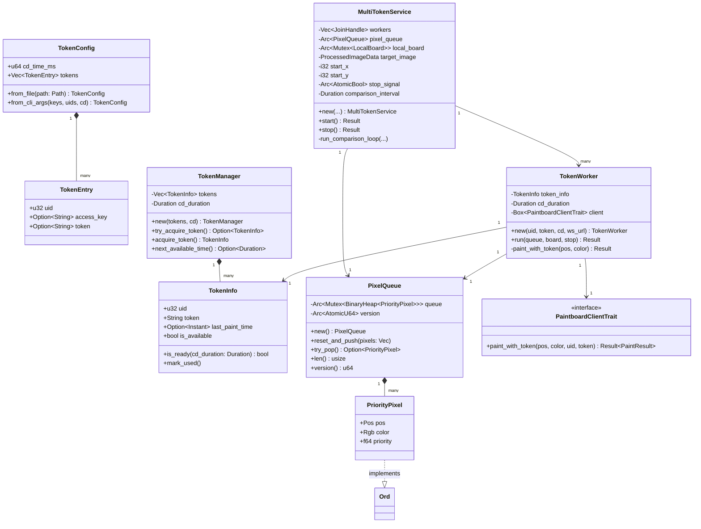
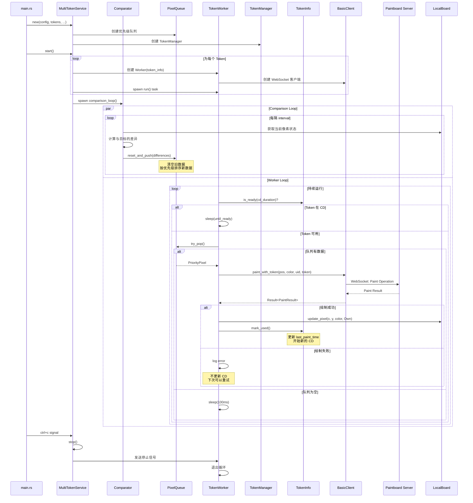
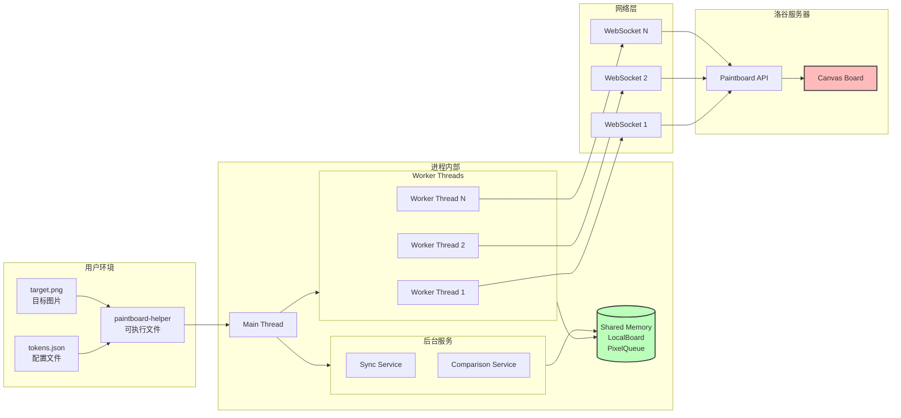

# 多 Token CD 模式架构图

## 1. 整体架构图

## 2. 数据流图

## 3. 状态机图（Worker）

## 4. 类图

## 5. 组件交互时序图（详细）

## 6. 部署架构图

---

## 设计要点总结

### 核心思想
1. **Producer-Consumer 模式**：比对循环作为生产者，Workers 作为消费者
2. **优先级调度**：使用二叉堆实现优先级队列，优先修复颜色差异大的像素
3. **CD 管理**：每个 Worker 独立管理自己的 Token CD 状态
4. **无锁设计**：Workers 使用 try_pop 避免阻塞，提高并发性能

### 关键优化
1. **队列版本号**：避免 Workers 处理过期数据
2. **非阻塞获取**：Workers 使用 try_pop 而不是阻塞等待
3. **本地更新**：绘制成功后立即更新 LocalBoard，避免重复绘制
4. **错误恢复**：绘制失败不更新 CD，允许下次重试

### 扩展性
1. **动态 Token**：TokenManager 可以支持运行时添加/删除 Token
2. **监控指标**：可以添加绘制速率、队列长度等统计
3. **配置热重载**：可以支持运行时调整 CD 时间