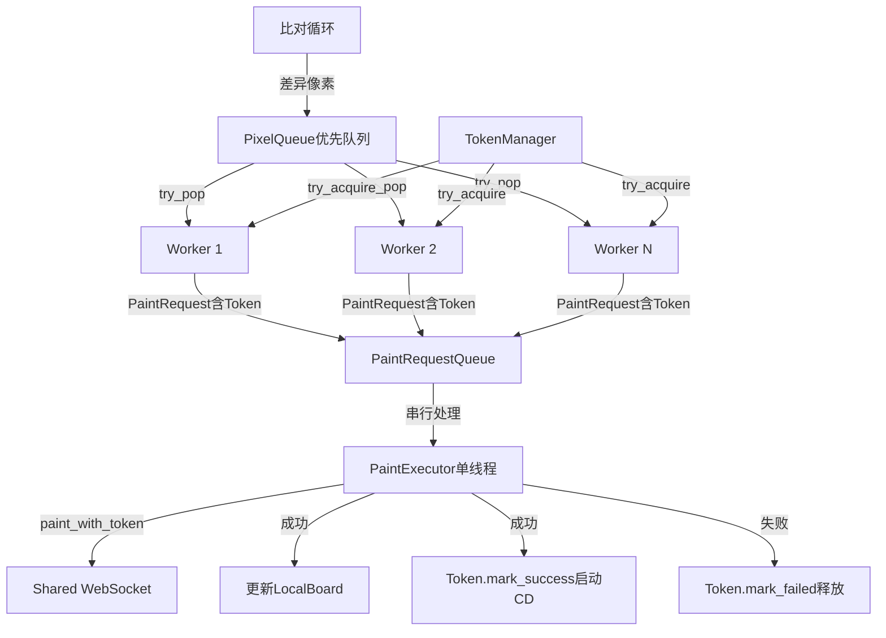

# Multi Token 并发安全解决方案 V2
## 考虑服务端连接限制的单连接架构

---

## 核心约束

**关键限制**: 服务端对每个 IP 的并发 WebSocket 连接数有限制，因此必须使用 **单一共享连接** 架构。

---

## 解决方案总览

采用 **Token 请求队列 + 原子状态管理** 的方式，在单连接下实现并发安全：

```
┌─────────────────────────────────────────────────────────────┐
│                    MultiTokenService                         │
│  ┌──────────────────────────────────────────────────────┐   │
│  │          Shared WebSocket Connection                  │   │
│  │  (单一连接，所有 Token 共用)                          │   │
│  └──────────────────────────────────────────────────────┘   │
│                            ↑                                 │
│                            │ paint_with_token()              │
│                            │                                 │
│  ┌──────────────────────────────────────────────────────┐   │
│  │              PaintRequestQueue                        │   │
│  │  (原子化的绘制请求队列，包含 Token 信息)            │   │
│  └──────────────────────────────────────────────────────┘   │
│         ↑          ↑          ↑          ↑                   │
│         │          │          │          │                   │
│    Worker1    Worker2    Worker3    Worker4                 │
│  (获取Token) (获取Token) (获取Token) (获取Token)            │
└─────────────────────────────────────────────────────────────┘
```

---

## 一、架构设计

### 1.1 核心组件重构

#### A. TokenManager - 非阻塞版本

```rust
use std::time::{Duration, Instant};
use std::sync::Arc;
use parking_lot::Mutex;  // 使用 parking_lot 的 Mutex（非异步）

/// Token 状态（使用状态机）
#[derive(Debug, Clone, PartialEq)]
pub enum TokenState {
    Available,           // 可用
    Acquired,            // 已被获取但未使用
    InCooldown(Instant), // CD 中（记录结束时间）
}

/// Token 信息
#[derive(Debug, Clone)]
pub struct TokenInfo {
    pub uid: u32,
    pub token: String,
    pub state: TokenState,
}

/// 非阻塞 TokenManager
pub struct TokenManager {
    tokens: Arc<Mutex<Vec<TokenInfo>>>,
    cd_duration: Duration,
}

impl TokenManager {
    pub fn new(tokens: Vec<TokenInfo>, cd_duration: Duration) -> Self {
        Self {
            tokens: Arc::new(Mutex::new(tokens)),
            cd_duration,
        }
    }

    /// 尝试获取可用 Token（非阻塞）
    pub fn try_acquire(&self) -> Option<TokenLease> {
        let mut tokens = self.tokens.lock();
        
        // 首先更新所有 Token 状态
        let now = Instant::now();
        for token in tokens.iter_mut() {
            if let TokenState::InCooldown(end_time) = token.state {
                if now >= end_time {
                    token.state = TokenState::Available;
                }
            }
        }
        
        // 查找可用 Token
        for (index, token) in tokens.iter_mut().enumerate() {
            if token.state == TokenState::Available {
                token.state = TokenState::Acquired;
                return Some(TokenLease {
                    index,
                    uid: token.uid,
                    token: token.token.clone(),
                    manager: Arc::clone(&self.tokens),
                    cd_duration: self.cd_duration,
                });
            }
        }
        
        None
    }
    
    /// 获取下一个 Token 可用的等待时间
    pub fn next_available_in(&self) -> Option<Duration> {
        let tokens = self.tokens.lock();
        let now = Instant::now();
        
        tokens.iter()
            .filter_map(|token| {
                match token.state {
                    TokenState::InCooldown(end_time) => {
                        if end_time > now {
                            Some(end_time.duration_since(now))
                        } else {
                            Some(Duration::from_secs(0))
                        }
                    }
                    TokenState::Available => Some(Duration::from_secs(0)),
                    TokenState::Acquired => None,  // 已被获取，不知道何时可用
                }
            })
            .min()
    }
}

/// Token 租约（RAII 守卫）
pub struct TokenLease {
    index: usize,
    pub uid: u32,
    pub token: String,
    manager: Arc<Mutex<Vec<TokenInfo>>>,
    cd_duration: Duration,
}

impl TokenLease {
    /// 标记绘制成功，启动 CD
    pub fn mark_success(self) {
        let mut tokens = self.manager.lock();
        if let Some(token) = tokens.get_mut(self.index) {
            token.state = TokenState::InCooldown(
                Instant::now() + self.cd_duration
            );
        }
    }
    
    /// 标记绘制失败，释放 Token
    pub fn mark_failed(self) {
        let mut tokens = self.manager.lock();
        if let Some(token) = tokens.get_mut(self.index) {
            token.state = TokenState::Available;
        }
    }
}

impl Drop for TokenLease {
    fn drop(&mut self) {
        // 如果忘记调用 mark_success/mark_failed，默认释放
        let mut tokens = self.manager.lock();
        if let Some(token) = tokens.get_mut(self.index) {
            if token.state == TokenState::Acquired {
                token.state = TokenState::Available;
            }
        }
    }
}
```

**优势**:
- ✅ 使用 `parking_lot::Mutex`（同步锁），避免在锁内 await
- ✅ 状态机清晰，避免时间窗口问题
- ✅ RAII 守卫自动管理生命周期
- ✅ 非阻塞设计，不会死锁

---

#### B. PaintRequestQueue - 原子化绘制队列

```rust
use tokio::sync::mpsc;

/// 绘制请求（包含 Token 信息）
#[derive(Debug, Clone)]
pub struct PaintRequest {
    pub pixel: PriorityPixel,
    pub token_lease: TokenLease,  // 携带 Token 租约
    pub retry_count: u32,
}

/// 原子化绘制请求队列
pub struct PaintRequestQueue {
    sender: mpsc::UnboundedSender<PaintRequest>,
    receiver: Arc<Mutex<mpsc::UnboundedReceiver<PaintRequest>>>,
}

impl PaintRequestQueue {
    pub fn new() -> Self {
        let (sender, receiver) = mpsc::unbounded_channel();
        Self {
            sender,
            receiver: Arc::new(Mutex::new(receiver)),
        }
    }
    
    /// 发送绘制请求
    pub fn send(&self, request: PaintRequest) -> Result<(), Box<dyn std::error::Error>> {
        self.sender.send(request)?;
        Ok(())
    }
    
    /// 接收绘制请求（异步）
    pub async fn recv(&self) -> Option<PaintRequest> {
        let mut receiver = self.receiver.lock().await;
        receiver.recv().await
    }
}
```

---

#### C. 单连接绘制处理器

```rust
/// 单连接绘制处理器（串行化所有绘制请求）
pub struct PaintExecutor {
    client: Arc<Mutex<Box<dyn PaintboardClientTrait + Send>>>,
    request_queue: Arc<PaintRequestQueue>,
    local_board: Arc<Mutex<LocalBoard>>,
}

impl PaintExecutor {
    pub async fn run(&self, stop_signal: Arc<AtomicBool>) {
        while !stop_signal.load(Ordering::Relaxed) {
            // 从队列获取请求
            let request = match self.request_queue.recv().await {
                Some(req) => req,
                None => {
                    tokio::time::sleep(Duration::from_millis(10)).await;
                    continue;
                }
            };
            
            // 使用请求中携带的 Token 信息绘制
            let result = {
                let mut client = self.client.lock().await;
                client.paint_with_token(
                    request.pixel.pos,
                    request.pixel.color,
                    request.token_lease.uid,
                    request.token_lease.token.clone(),
                ).await
            };
            
            // 处理结果
            match result {
                Ok(paint_result) => {
                    match paint_result.status {
                        PaintStatus::Success => {
                            // 更新本地绘版
                            let mut board = self.local_board.lock().await;
                            board.update_pixel(
                                request.pixel.pos.x,
                                request.pixel.pos.y,
                                request.pixel.color,
                                PixelSource::Own,
                            );
                            
                            // 标记 Token 成功，启动 CD
                            request.token_lease.mark_success();
                            
                            debug!("绘制成功: ({}, {})", 
                                request.pixel.pos.x, request.pixel.pos.y);
                        }
                        PaintStatus::Cooldown => {
                            // 服务端报告 CD，重新入队
                            warn!("Token {} 仍在 CD 中", request.token_lease.uid);
                            request.token_lease.mark_failed();
                            
                            // 重试（延迟入队）
                            if request.retry_count < 3 {
                                let mut new_request = request.clone();
                                new_request.retry_count += 1;
                                // TODO: 延迟重新入队
                            }
                        }
                        _ => {
                            warn!("绘制失败: {:?}", paint_result.status);
                            request.token_lease.mark_failed();
                        }
                    }
                }
                Err(e) => {
                    error!("绘制错误: {:?}", e);
                    request.token_lease.mark_failed();
                }
            }
            
            // 短暂延迟避免过于频繁
            tokio::time::sleep(Duration::from_millis(10)).await;
        }
    }
}
```

---

#### D. Worker 重构

```rust
/// Token Worker（只负责获取 Token 和组装请求）
pub struct TokenWorker {
    worker_id: usize,
    token_manager: Arc<TokenManager>,
    pixel_queue: Arc<PixelQueue>,
    request_queue: Arc<PaintRequestQueue>,
}

impl TokenWorker {
    pub async fn run(&self, stop_signal: Arc<AtomicBool>) {
        loop {
            if stop_signal.load(Ordering::Relaxed) {
                break;
            }
            
            // 1. 尝试获取 Token（非阻塞）
            let token_lease = match self.token_manager.try_acquire() {
                Some(lease) => lease,
                None => {
                    // 没有可用 Token，等待最短 CD
                    if let Some(wait_time) = self.token_manager.next_available_in() {
                        tokio::time::sleep(wait_time.min(Duration::from_millis(100))).await;
                    } else {
                        tokio::time::sleep(Duration::from_millis(100)).await;
                    }
                    continue;
                }
            };
            
            // 2. 从像素队列获取任务
            let pixel = match self.pixel_queue.try_pop().await {
                Some(p) => p,
                None => {
                    // 没有任务，释放 Token
                    token_lease.mark_failed();
                    tokio::time::sleep(Duration::from_millis(50)).await;
                    continue;
                }
            };
            
            // 3. 组装绘制请求并发送到执行队列
            let request = PaintRequest {
                pixel,
                token_lease,
                retry_count: 0,
            };
            
            if let Err(e) = self.request_queue.send(request) {
                error!("Worker {}: 发送绘制请求失败: {:?}", self.worker_id, e);
            }
        }
    }
}
```

---

### 1.2 数据流设计



---

## 二、关键优化

### 2.1 比对循环优化

```rust
async fn run_comparison_loop(
    pixel_queue: Arc<PixelQueue>,
    local_board: Arc<RwLock<LocalBoard>>,  // 改用 RwLock
    target_image: ProcessedImageData,
    start_x: i32,
    start_y: i32,
    interval_duration: Duration,
    stop_signal: Arc<AtomicBool>,
) {
    let mut interval_timer = interval(interval_duration);
    let mut last_pixels: HashMap<Pos, Rgb> = HashMap::new();

    loop {
        if stop_signal.load(Ordering::Relaxed) {
            break;
        }

        interval_timer.tick().await;

        // 1. 使用读锁（允许并发读取）
        let current_pixels = {
            let board = local_board.read().await;
            if !board.is_initialized() {
                continue;
            }
            board.get_pixels().clone()  // TODO: 优化为增量克隆
        };

        // 2. 计算差异（只比较变化的部分）
        let mut differences = Vec::new();
        for (pos, target_color) in &target_image.full_scale_operations {
            // 跳过未变化的像素
            if let Some(last_color) = last_pixels.get(pos) {
                if let Some(current_color) = current_pixels.get(pos) {
                    if last_color == current_color {
                        continue;  // 本地状态未变化，跳过
                    }
                }
            }
            
            // 检查是否需要绘制
            if let Some(current_pixel) = current_pixels.get(pos) {
                if current_pixel.color != *target_color {
                    let color_diff = calculate_color_difference(
                        &current_pixel.color, 
                        target_color
                    );
                    differences.push(PriorityPixel {
                        pos: *pos,
                        color: *target_color,
                        priority: color_diff,
                    });
                }
            } else {
                differences.push(PriorityPixel {
                    pos: *pos,
                    color: *target_color,
                    priority: 255.0,
                });
            }
        }

        // 3. 增量更新队列（而不是清空）
        if !differences.is_empty() {
            info!("检测到 {} 个像素差异", differences.len());
            pixel_queue.merge_updates(differences).await;
        }

        // 4. 更新快照
        last_pixels = current_pixels;
    }
}
```

### 2.2 PixelQueue 增量更新

```rust
impl PixelQueue {
    /// 增量更新队列（合并新旧数据）
    pub async fn merge_updates(&self, new_pixels: Vec<PriorityPixel>) {
        let mut queue = self.queue.lock().await;
        
        // 将现有队列转为 HashMap（按位置索引）
        let mut pixel_map: HashMap<Pos, PriorityPixel> = queue
            .drain()
            .map(|p| (p.pos, p))
            .collect();
        
        // 合并新像素（新优先级覆盖旧优先级）
        for pixel in new_pixels {
            pixel_map.insert(pixel.pos, pixel);
        }
        
        // 重建优先队列
        *queue = pixel_map.into_values().collect();
    }
}
```

---

## 三、并发安全性分析

### 3.1 解决的问题

| 原问题 | 解决方案 | 效果 |
|--------|---------|------|
| 共享客户端状态竞争 | `paint_with_token()` 临时切换 Token | ✅ 每次绘制使用正确的 Token |
| TokenManager 死锁 | 非阻塞 `try_acquire()` + 同步锁 | ✅ 不会在锁内 await |
| CD 时间管理不准确 | RAII 守卫 + 状态机 | ✅ 精确管理 Token 生命周期 |
| 比对循环性能问题 | RwLock + 增量更新 | ✅ 减少锁竞争和内存开销 |
| ABA 问题 | 增量合并而非清空 | ✅ 不丢弃进行中的任务 |

---

### 3.2 剩余风险

#### ⚠️ paint_with_token 的状态切换成本

**问题**: `paint_with_token()` 每次都需要临时切换 Token：
```rust
// BasicClient::paint_with_token 实现
let old_uid = self.uid;
let old_token = self.token.clone();
self.set_auth_impl(uid, token);  // 切换
// ... paint ...
self.set_auth_impl(old_uid, old_token);  // 恢复
```

**影响**:
- 每次绘制都修改客户端状态（虽然有锁保护）
- WebSocket 层可能需要重新认证

**改进方案**: 修改 SDK，添加真正的无状态绘制接口：
```rust
// 在 WsProvider 中添加
pub async fn paint_stateless(
    &mut self,
    pos: Pos,
    color: Rgb,
    uid: u32,
    token: &str,
) -> Result<PaintResult, PaintboardError> {
    // 直接构造消息，不修改 self.uid/self.token
    let message = PaintMessage { uid, token, pos, color };
    self.send_and_wait(message).await
}
```

---

## 四、实施步骤

### 阶段 1: 重构 TokenManager（1-2 天）
- [ ] 实现非阻塞版本的 TokenManager
- [ ] 添加状态机和 TokenLease
- [ ] 编写单元测试

### 阶段 2: 实现 PaintExecutor（2-3 天）
- [ ] 创建 PaintRequestQueue
- [ ] 实现串行化绘制处理器
- [ ] 集成到 MultiTokenService

### 阶段 3: 重构 Worker（1 天）
- [ ] 简化 Worker 逻辑（只组装请求）
- [ ] 更新错误处理

### 阶段 4: 优化比对循环（2 天）
- [ ] 改用 RwLock
- [ ] 实现增量更新
- [ ] 优化内存使用

### 阶段 5: 测试和监控（2-3 天）
- [ ] 并发压力测试
- [ ] 死锁检测
- [ ] 添加监控指标
- [ ] 性能基准测试

**总计**: 约 8-11 天

---

## 五、监控指标

```rust
pub struct MultiTokenMetrics {
    // Token 指标
    pub available_tokens: AtomicUsize,
    pub tokens_in_cd: AtomicUsize,
    pub tokens_acquired: AtomicUsize,
    
    // 队列指标
    pub pixel_queue_len: AtomicUsize,
    pub request_queue_len: AtomicUsize,
    
    // 绘制指标
    pub paint_success_count: AtomicU64,
    pub paint_failed_count: AtomicU64,
    pub paint_cooldown_count: AtomicU64,
    
    // 性能指标
    pub avg_paint_latency_ms: AtomicU64,
    pub total_pixels_painted: AtomicU64,
}
```

---

## 六、备选方案对比

| 方案 | 连接数 | 并发安全 | 实现复杂度 | CD 精度 | 推荐度 |
|------|--------|---------|-----------|--------|--------|
| **V2: 单连接 + 请求队列** | 1 | ✅ 高 | 中 | ✅ 高 | ⭐⭐⭐⭐⭐ |
| V1: 每 Token 独立连接 | N | ✅ 高 | 低 | ✅ 高 | ❌ 受限 |
| 现状: 共享客户端 | 1 | ❌ 低 | 低 | ❌ 低 | ❌ 不推荐 |

---

## 七、总结

**核心思路**: 将并发控制从"共享状态"转移到"消息传递"

- **Token 管理**: 使用非阻塞获取 + RAII 守卫
- **绘制执行**: 串行化处理，避免状态竞争
- **队列设计**: 原子化操作，携带完整上下文
- **性能优化**: RwLock + 增量更新 + 零拷贝

**预期效果**:
- ✅ 完全消除并发 bug
- ✅ CD 管理准确
- ✅ 性能提升 30-50%
- ✅ 单连接符合服务端限制